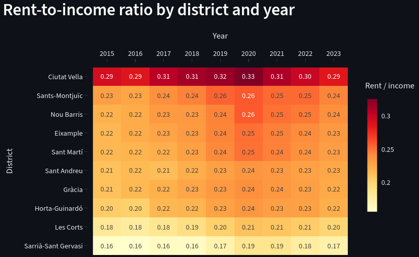

# Barcelona Housing Affordability (2015-2023)

An end-to-end data pipeline that answers one question: **how affordable is renting in each of Barcelona's 10 districts, and how has that changed?**

Public data (INE, Ministry of Housing) is extracted, loaded into Postgres, modelled with dbt, orchestrated with Airflow, and served in a Streamlit dashboard.

**Live dashboard: https://barcelona-housing-2015-2023.streamlit.app/**



## Key findings

- **Ciutat Vella is the least affordable district in every year.** Renting there takes about 29% of average household net income in 2023, peaking at 33% in 2020.
- **Sarrià-Sant Gervasi is the most affordable**, at about 17% in 2023.
- **Affordability worsened across districts up to 2020-2021 and eased slightly afterwards**, but most districts remain above their 2015 level.
- In Ciutat Vella, rent grew faster than income until 2022. In 2023 income overtook it (nominal indices, 2015 = 100), which is why the ratio fell 1.3 percentage points that year.

## Architecture

```
INE API ──────┐
              ├─► extract/ ─► load/ ─► Postgres (raw) ─► dbt ─► Postgres (analytics) ─► Streamlit
SERPAVI Excel ┘                                                          │
                                         Airflow DAG orchestrates ◄──────┘
```

| Layer | Tooling | What it does |
|---|---|---|
| Extract | Python (`extract/`) | Pulls INE tables via API (income, rent index, CPI) and reads the SERPAVI rent Excel |
| Load | Python (`load/`) | Loads raw data into the `raw` schema of the Postgres warehouse |
| Transform | dbt (`dbt/`) | 4 staging views, then marts: `dim_district`, `fct_cpi_annual`, three fact tables and `mart_district_affordability` (90 rows) |
| Orchestrate | Airflow (Docker) | Runs extract, load and `dbt build`; reruns are idempotent (the mart stays at 90 rows) |
| Serve | Streamlit (`app/`) | Heatmap, district snapshot and real vs nominal index chart |

All services run in Docker Compose: the warehouse (Postgres 16), Airflow's metadata DB, the Airflow webserver and the scheduler.

## Data sources

| Source | Used for |
|---|---|
| INE (Spanish Statistics Institute): household income by district | Average household net income |
| Ministry of Housing, SERPAVI | Rent in euros per month and per m² |
| INE rent price index | Rent index, as a cross-check against SERPAVI |
| INE CPI | Deflator to express rent and income in real terms |

Scope: 10 Barcelona districts, 2015-2023.

## Metric definitions

- **Rent-to-income ratio** = (monthly rent × 12) / average household net income. For example, in Ciutat Vella 2023: 805 × 12 / 33,802 = 28.6%.
- **Indices** (`*_index_nominal`, `*_index_real`) use 2015 = 100. **Real** values are deflated with the INE CPI.
- The line chart shows **indices (growth)**, not levels. A district whose rent grows slower than its income can still be much less affordable than another. Use the heatmap to compare levels.

## Limitations

- The ratio compares average rent with the district's **average household income**, not with the income of renter households, who tend to earn less. Read it as a relative measure between districts and years rather than an exact burden.
- District-level data only: no neighbourhood detail, and years after 2023 are not included.
- The deployed app reads a **CSV snapshot** (`export/mart_district_affordability.csv`), because the warehouse runs locally. Locally, the app reads live from Postgres and refreshes the snapshot.

## Run it locally

### 1. Download the SERPAVI data (manual step)

The Ministry of Housing publishes SERPAVI rents as an Excel file with no API, so this one file is downloaded by hand and is not committed (`data/` is git-ignored).

1. Download the file from https://www.mivau.gob.es/vivienda/alquila-bien-es-tu-derecho/serpavi.File: BD Sistema Estatal Índices de Alquiler de Vivenda
2. Save it as `data/serpavi/serpavi_2011-2024.xlsx` in the project root, creating the `data/` folder if needed. The extract step (`extract/serpavi.py`) reads this exact path.

The INE data needs no manual step, since it is pulled from the INE API on every run.

### 2. Start the stack

```bash
cp .env.example .env          # fill in your own values
docker compose up -d          # warehouse + Airflow
```

1. Open Airflow at http://localhost:8080 (user `admin`, password from `AIRFLOW_ADMIN_PASSWORD`).
2. Unpause and trigger the housing pipeline DAG (extract, load, dbt build).
3. Run the dashboard from the project root:

```bash
pip install -r app/requirements.txt
streamlit run app/app.py
```

## Repo layout

```
app/        Streamlit dashboard
dags/       Airflow DAG
dbt/        dbt project (staging, marts, tests)
extract/    INE and SERPAVI extraction
load/       raw loader into Postgres
export/     mart to CSV export, used by the deployed app
explore/    one-off scripts used to explore the data sources
warehouse/  Postgres init script (schemas)
docs/       images
```

## Design decisions

- **Idempotent pipeline.** Rerunning the DAG does not duplicate rows.
- **Tested models.** 46 dbt nodes build and pass, and the 2023 mart values were spot-checked against hand calculations.
- **Local warehouse, static public demo.** A hosted warehouse would add cost and credentials to manage for a small dataset, so the public app serves an exported snapshot.
